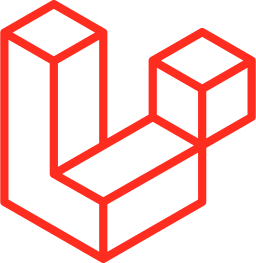
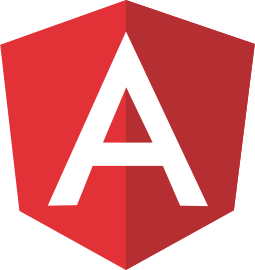

## Hola, soy Leandro 👋 🇦🇷

Licenciado en Sistemas de Información (UBA) y Desarrollador Web Full Stack.

-  **Portafolio:** [leandroarturi.com.ar](https://leandroarturi.com.ar)
-  **Twitter:** [@leandroarturi](https://twitter.com/leandroarturi)
-  **LinkedIn:** [@leandroarturi](https://www.linkedin.com/in/leandroarturi)

# Repositorios

A continuación comparto mis repositorios públicos, ordenados por tecnología y algunos demos.

##  React

**Portafolio**\
[Gatsby](https://github.com/larturi/portfolio-gatsby) / [Strapi](https://github.com/larturi/portfolio-strapi) / [Demo](https://leandroarturi.com.ar)

**iCard**\
[React](https://github.com/larturi/react-icard) / [Django](https://github.com/larturi/django-rest-icard) / En Desarollo

**Instagram Clone**\
[Next](https://github.com/larturi/react-apollo-instaclone-client) / [Apollo](https://github.com/larturi/apollo-instaclone-server) / [Demo](https://instaclone-react.netlify.app)

**E-Commerce**\
[Next](https://github.com/larturi/react-ecommerce-client) / [Strapi](https://github.com/larturi/strapi-ecommerce-server) / [Demo](http://cloudapp.com.ar/ecommerce-games)

**Todolist MERN**\
[Next](https://github.com/larturi/react-todolist-mern-cliente) / [Node](https://github.com/larturi/node-todolist-mern-ts-server) / [Demo](http://www.todolist-mern.cloudapp.com.ar)

**CRM Next**\
[Next](https://github.com/larturi/react-graphql-crm) / [Apollo](https://github.com/larturi/node-graphql-crm) / [Demo](http://cloudapp.com.ar/crm-next-apollo)

**Crypto CoinGecko App**\
[React](https://github.com/larturi/react-crypto-coingecko) / [Demo](https://react-crypto-coingecko.netlify.app/)

**MERN Tasks**\
[React](https://github.com/larturi/react-mern-tasks) / [Node](https://github.com/larturi/node-mern-tasks) / [Demo](http://mern-tasks.cloudapp.com.ar/)

Products Hunt\
[Next & Firebase](https://github.com/larturi/react-next-producthunt) / [Demo](https://product-hunt-1f8d8.web.app)

Filetransfer\
[React](https://github.com/larturi/react-filetransfer-cliente) / [Node](https://github.com/larturi/node-filetransfer-backend) / [Demo](https://react-filetransfer-cliente.vercel.app/)

Calendar\
[React & Firebase](https://github.com/larturi/react-journal-app) / [Demo](http://calendar-react.cloudapp.com.ar/login)

Giphy App\
[React](https://github.com/larturi/react-gift-app) / [Demo](http://cloudapp.com.ar/demo/gif-react)

Drinks App\
[React](https://github.com/larturi/react-drinks) / [Demo](http://cloudapp.com.ar/demo/drinks)

Curriculum\
[Gatsby](https://github.com/larturi/react-gatsby-curriculum) / [Demo](https://gatsby-curriculum.netlify.app)

Hotel Gatsby\
[Gatsby](https://github.com/larturi/react-hotel-gatsby) / [Demo](https://gatsby-hotel-app.netlify.app/)

Bienes Raices\
[Gatsby](https://github.com/larturi/react-propiedades-front-gatsby) / [Strapi](https://github.com/larturi/node-propiedades-back) / [Demo](https://bienesraices-gatsby-app.netlify.app/)

Buscador de Canciones\
[React](https://github.com/larturi/react-lyrics) / [Demo](http://cloudapp.com.ar/demo/lyrics)

Criptomonedas App\
[React](https://github.com/larturi/react-criptomonedas) / [Demo](http://cloudapp.com.ar/demo/cripto)

Heroes App\
[React](https://github.com/larturi/react-heroes-app) / [Demo](https://heros-react-app.netlify.app)

Breaking Bad App\
[React](https://github.com/larturi/react-breakingbad-api) / [Demo](https://breakingbad-app-react.netlify.app)

Basic Budget\
[React](https://github.com/larturi/react-presupuesto) / [Demo](https://budget-basic-react-app.netlify.app)

Cotizador de Seguros\
[React](https://github.com/larturi/react-cotizador) / [Demo](https://cotizador-react-app-ok.netlify.app)

Citas App\
[React](https://github.com/larturi/react-citas) / [Demo](https://agenda-turnos-react.netlify.app)

Imágenes Pixabay\
[React](https://github.com/larturi/react-imagenes-pixabay) / [Demo](https://images-pixabay-react-app.netlify.app)

Tickets App\
[React](https://github.com/larturi/react-tickets-app) / [Node](https://github.com/larturi/-node-tickets-app-server)

Noticias App\
[React](https://github.com/larturi/react-noticias)

CRUD Productos (Redux)\
[React](https://github.com/larturi/react-redux-crud-productos)

Mapbox SocketIO\
[React](https://github.com/larturi/react-mapas-client) / [Server](https://github.com/larturi/node-mapas-server)

Clima App\
[React](https://github.com/larturi/react-clima)

MERN Chat\
[React](https://github.com/larturi/react-chatapp-app) / [Node](https://github.com/larturi/node-chatapp-server)

##  Django

-  **iCard**: [Django](https://github.com/larturi/django-rest-icard) / [React](https://github.com/larturi/react-icard) / En Desarollo
-  Users App: [Django](https://github.com/larturi/django-users) / [Demo](https://django-user-app.herokuapp.com/login/)
-  Biblioteca App: [Django](https://github.com/larturi/django-biblioteca) / [Demo]( https://django-biblioteca.herokuapp.com)
-  Empleados App: [Django](https://github.com/larturi/django-empleados) / [Demo](https://django-empleados.herokuapp.com)
-  MyBlog App: [Django](https://github.com/larturi/django-myblog)
-  Web Page Cursos: [Django](https://github.com/larturi/django-webpage/tree/main)
-  API Blog: [Django](https://github.com/larturi/django-rest-blog-full)
-  API Agenda: [Django](https://github.com/larturi/django-rest-agenda)
-  API Profiles: [Django](https://github.com/larturi/django-profiles-api)
-  API Polls: [Django](https://github.com/larturi/django_polls)
-  API Blog Basic: [Django](https://github.com/larturi/django-rest-blog-basic)
-  API PoC: [Django](https://github.com/larturi/django-apirest-lab-tests)

##  Python

- **Callejero Argenprop**: [Python](https://github.com/larturi/python-argenprop-callejero)
- CRUD Python Tkinter: [Python](https://github.com/larturi/python-crud-tkinter/blob/main/README.md)
- PoCs & Labs: [Python](https://github.com/larturi/python-labs)

##  FastAPI

-  PoC FastAPI & GraphQL: [FastAPI](https://github.com/larturi/fastapi-graphql-postgre)

##  Node

- **Portafolio**: [Gatsby](https://github.com/larturi/portfolio-gatsby) / [Strapi](https://github.com/larturi/portfolio-strapi) / [Demo](https://leandroarturi.com.ar)
- **Instagram Clone**: [Next](https://github.com/larturi/react-apollo-instaclone-client) / [Apollo](https://github.com/larturi/apollo-instaclone-server) / [Demo](https://instaclone-react.netlify.app/caraoz)
- **E-Commerce**: [Next](https://github.com/larturi/react-ecommerce-client) / [Strapi](https://github.com/larturi/strapi-ecommerce-server) / [Demo](http://cloudapp.com.ar/ecommerce-games)
- **CRM Next**: [Next](https://github.com/larturi/react-graphql-crm) / [Apollo](https://github.com/larturi/node-graphql-crm) / [Demo](http://cloudapp.com.ar/crm-next-apollo)
- **MERN Tasks**: [React](https://github.com/larturi/react-mern-tasks) / [Node](https://github.com/larturi/node-mern-tasks) / [Demo](http://mern-tasks.cloudapp.com.ar/)
- **Todolist MERN**: [Next](https://github.com/larturi/react-todolist-mern-cliente) / [Node](https://github.com/larturi/node-todolist-mern-ts-server) / [Demo](http://www.todolist-mern.cloudapp.com.ar)
- **Filetransfer App**: [React](https://github.com/larturi/react-filetransfer-cliente) / [Node](https://github.com/larturi/node-filetransfer-backend) / [Demo](https://react-filetransfer-cliente.vercel.app/)
- Bienes Raices: [Gatsby](https://github.com/larturi/react-propiedades-front-gatsby) / [Strapi](https://github.com/larturi/node-propiedades-back) / [Demo](https://bienesraices-gatsby-app.netlify.app/)
- PoCs & Labs: [Node](https://github.com/larturi/node-labs)
- Apollo Server MySQL TypeScript [Node](https://github.com/larturi/apollo-graphql-typescript)
- Tickets App: [React](https://github.com/larturi/react-tickets-app) / [Node](https://github.com/larturi/-node-tickets-app-server)
- Bands Names: [SocketIO](https://github.com/larturi/socketio-band-names-server) / [Client](https://github.com/larturi/socketio-band-names)
- Turnos: [Node](https://github.com/larturi/node-turnos)
- FizzBuzz: [Node](https://github.com/larturi/node-ts-fizzbuzz)
- Chat Básico: [SocketIO](https://github.com/larturi/socketio-chat-basico)
- Weather App: [Node](https://github.com/larturi/node-weather-app)
- Clima App: [Node](https://github.com/larturi/node-clima)
- MEVN CRUD PoC: [Vue](https://github.com/larturi/vue-crud-node-frontend) / [Node](https://github.com/larturi/vue-crud-node-backend)
- Todo Terminal App: [Node](https://github.com/larturi/node-por-hacer)
- Node TypeScript MySQL: [Node](https://github.com/larturi/node-ts-mysql)
- Chat: [Node](https://github.com/larturi/node-socket-chat)
- Todo Terminal App II: [Node](https://github.com/larturi/node-todolist-app)
- Apollo Server MySQL [Node](https://github.com/larturi/apollo-graphql-mysql-server)
- MERN Chat: [React](https://github.com/larturi/react-chatapp-app) / [Node](https://github.com/larturi/node-chatapp-server)

##  Laravel

- **Todolist Nuxt**: [Nuxt](https://github.com/larturi/vue-nuxt-todolist-client) / [Laravel](https://github.com/larturi/laravel-vue-todolist-backend) / [Demo](http://todolist-vue.cloudapp.com.ar/dist)
- **Cartera Sistemas**: [Laravel & Vue](https://github.com/larturi/laravel-cartera-sistemas) / [Demo](http://www.carteradesistemas.cloudapp.com.ar/login)
- **Portal Dev Jobs**: [Laravel](https://github.com/larturi/laravel-devJobs) / [Demo](http://www.devjobs.cloudapp.com.ar/)
- **Red Social Recetas**: [Laravel](https://github.com/larturi/laravel-recetas-cocina) / [Demo](http://www.recetas.cloudapp.com.ar)
- **Establecimientos**: [Laravel](https://github.com/larturi/laravel-establecimientos)
- **Hoy Jugamos**: [Laravel](https://github.com/larturi/php-hoyjugamos) / [Demo](http://hoyjugamos.cloudapp.com.ar/)
-  CURD Laravel: [Laravel](https://github.com/larturi/laravel-abm)
-  CURD Laravel II: [Laravel](https://github.com/larturi/laravel-abm2)

##  Php

-  Famosos Twitter: [Php](https://github.com/larturi/php-famosos-twitter) / [Demo](http://www.famososentwitter.com.ar/noticias-de-famosos-en-twitter/all/1.php)
-  Seis Sombreros: [Php](https://github.com/larturi/php-seis-sombreros) / [Demo](http://testsombreros.site/)
-  Chistes: [Php](https://github.com/larturi/php-chistessincodificar) / [Demo](http://chistescodificados.cloudapp.com.ar/controllers/chiste.php?accion=listar)
-  Programmer Day: [Php](https://github.com/larturi/php-programmerday) / [Demo](http://programmerday.cloudapp.com.ar)
-  Trivia Series: [Php](https://github.com/larturi/php-triviaseries)
-  Maschefacts: [Php](https://github.com/larturi/php-maschefacts)
-  PoCs & Labs: [Php](https://github.com/larturi/php-labs)

##  Angular

-  **Burguers**: [Angular & Firebase](https://github.com/larturi/angular-burguer-queen) / [Demo](http://cloudapp.com.ar/demo/burgers/#/list-categories)
-  **Chat Angular**: [Angular & Firebase](https://github.com/larturi/angular-firechat) / [Demo](http://cloudapp.com.ar/demo/firechat/)
-  **Heroes**: [Angular](https://github.com/larturi/angular-buscador-heroes) / [Demo](http://cloudapp.com.ar/demo/heroes-ng/#/heroes)
-  **Películas App**: [Angular](https://github.com/larturi/angular-peliculas) / [Demo](http://cloudapp.com.ar/demo/peliculas/#/home)
-  **Blackjack**: [Angular](https://github.com/larturi/js-blackjack) / [Demo](http://cloudapp.com.ar/demo/blackjack/#/juego)
-  **Blog**: [Angular](https://github.com/larturi/angular-blog) / [Demo](https://angular-blog-app.netlify.app)
-  **Blog Admin**: [Angular](https://github.com/larturi/angular-dasboard-blog) / [Demo](https://blog-admin-angular.netlify.app)
-  Game of the year: [Angular](https://github.com/larturi/angular-goty) / [Demo](http://cloudapp.com.ar/demo/goty/#/inicio)
-  Drag & Drop Países: [Angular](https://github.com/larturi/angular-drag-drop-paises)
-  Upload Images: [Angular](https://github.com/larturi/angular-uploadimages-firebase) / [Demo](http://cloudapp.com.ar/demo/upload-images/#/fotos)
-  Gráficos: [Angular](https://github.com/larturi/angular-graficos)
-  Maps PoC: [Angular](https://github.com/larturi/angular-mapas)
-  Reservas App: [Angular](https://github.com/larturi/angular-reservas-peluqueria)
-  Contactos App: [Angular](https://github.com/larturi/angular-contact-list)
-  Pipes: [Angular](https://github.com/larturi/angular-pipes)
-  Preguntas y Respuestas: [Angular](https://github.com/larturi/angular-preguntas-respuestas)
-  CRUD Firebase: [Angular & Firebase](https://github.com/larturi/angular-crud-firebase)
-  Login Firebase: [Angular & Firebase](https://github.com/larturi/angular-login-firebase)
-  Angular Todolist: [Angular](https://github.com/larturi/angular-task-list)

##  Vue

- **Todolist Nuxt**: [Nuxt](https://github.com/larturi/vue-nuxt-todolist-client) / [Laravel](https://github.com/larturi/laravel-vue-todolist-backend) / [Demo](http://todolist-vue.cloudapp.com.ar/dist)
- **Matafuegos**: [Nuxt](https://github.com/larturi/vue-nuxt-matafuegos) / [Demo](https://matafuegos-nuxt.netlify.app/)
- Buscador Banderas: [Vue](https://github.com/larturi/vue-buscador-banderas) / [Demo](https://vue-flags-api.netlify.app)
- CRUD Firebase Auth: [Vue](https://github.com/larturi/vue-crud-firebase-auth)
- Cotización Dólar: [Vue](https://github.com/larturi/vue-axios-vuetify-dolar)
- Composition PoC: [Vue](https://github.com/larturi/vue-composition-poc)
- MEVN CRUD PoC: [Vue](https://github.com/larturi/vue-crud-node-frontend) / [Node](https://github.com/larturi/vue-crud-node-backend)

##  Docker
- Django & Postgres & React App: [Docker](https://github.com/larturi/docker-django-rest-react-poc)
- Postgres & PgAdmin: [Docker](https://github.com/larturi/docker-postgres-pgadmin)
- Php8 & MySQL: [Docker](https://github.com/larturi/docker-php8-mysql)
- Php5.4 & MySQL: [Docker](https://github.com/larturi/docker-php54-mysql)
- Laravel & MySQL & PhpMyAdmin: [Docker](https://github.com/larturi/docker-laravel-mysql)

##  Vanilla JS

- **Portafolio Old**: [JavaScript](https://github.com/larturi/js-leandroarturi)
- **BlockChain**: [JavaScript](https://github.com/larturi/js-blockchain)
- The Vision Test: [JavaScript](https://github.com/larturi/js-the-vision-test) / [Demo](http://cloudapp.com.ar/visiontest)
- Simon: [JavaScript](https://github.com/larturi/js-simon) / [Demo](http://cloudapp.com.ar/demo/simon)

##  Bootstrap

- Red Social: [Bootstrap](https://github.com/larturi/bootstrap-red-social) / [Demo](https://larturi.github.io/bootstrap-red-social)
- Dashboard: [Bootstrap](https://github.com/larturi/bootstrap-dashboard) / [Demo](https://larturi.github.io/bootstrap-dashboard/)
- Portafolio: [Bootstrap](https://github.com/larturi/bootstrap-portafolio) / [Demo](https://larturi.github.io/bootstrap-portafolio)
- Vanilla: [Bootstrap](https://github.com/larturi/bootstrap-vanilla-ejemplos) / [Album](https://larturi.github.io/bootstrap-vanilla-ejemplos/album.html) / [Blog](https://larturi.github.io/bootstrap-vanilla-ejemplos/blog.html)

##  Tailwind

- Airbnb: [Tailwind](https://github.com/larturi/tailwind-airbnb) / [Demo](https://larturi.github.io/tailwind-airbnb/)

##  Ionic

-  Ionic Todolist: [Ionic](https://github.com/larturi/angular-todolist) / [Demo](http://cloudapp.com.ar/demo/todolist-ng/#/tabs/tab1)

##  React Native

-  **Películas**: [React Native](https://github.com/larturi/react-native-peliculas)
-  **Calculadora**: [React Native](https://github.com/larturi/react-native-calculadora)
-  Counter App: [React Native](https://github.com/larturi/react-native-counter-app)

##  Flutter

-  **Películas**: [Flutter](https://github.com/larturi/flutter-peliculas)
-  News: [Flutter](https://github.com/larturi/flutter-news)
-  User Preferences: [Flutter](https://github.com/larturi/flutter-user-preferences)
-  QR: [Flutter](https://github.com/larturi/flutter-qr)
-  Diseños Flutter: [Flutter](https://github.com/larturi/flutter-disenos)
