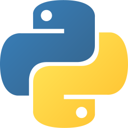

# Leandro Arturi

I am a Tech Lead & Full Stack Engineer, graduated in Systems Information from the University of Buenos Aires. I am passionate about the world of development, which keeps me constantly learning. I am motivated by long-term projects, but I also enjoy solving problems. I am a pragmatic, flexible and organized person. I am always predisposed to learn and to offer my help.

#### Top Technologies

 
 
 

 
 

#### More Technologies

#### Contact Me

#### Top Projects
| # | Project                                                                    | FE                                                                                                                                         | BE                                                                                                                                             |
| - | -------------------------------------------------------------------------- | ------------------------------------------------------------------------------------------------------------------------------------------ | ---------------------------------------------------------------------------------------------------------------------------------------------- |
| 1 | [Next Full Stack Airbnb Clone](https://next-clone-seven-abnb.vercel.app)   | [](https://github.com/larturi/next-airbnb-clone)     |                                                                                                                                                |
| 2 | [Next Tesla E-Commerce Clone](https://tesloshop-nextjs.vercel.app)         | [](https://github.com/larturi/next-teslo-shop)       | [](https://github.com/larturi/nest-teslo-api)                     |
| 3 | [Next Full Stack Netflix Clone](https://lnamovies-clone.vercel.app)        | [](https://github.com/larturi/next-netflix-clone)    |                                                                                                                                                |
| 4 | [Next Jira Clone](https://next-open-jira-app.vercel.app)                   | [](https://github.com/larturi/next-open-jira)        |                                                                                                                                                |
| 5 | [Portafolio Gatsby](https://leandroarturi.com.ar)                          | [](https://github.com/larturi/portfolio-gatsby)         | [](https://github.com/larturi/portfolio-strapi)          |
| 6 | [Word Forms Practice](https://next-words-form.vercel.app)                  | [](https://github.com/larturi/next-words-form)       | [](https://github.com/larturi/fastapi-words-forms)         |
| 7 | [Filetransfer](https://react-filetransfer-cliente.vercel.app)              | [](https://github.com/larturi/react-filetransfer-cliente) | [](https://github.com/larturi/node-filetransfer-backend) |
| 8 | [Next Pokemon](https://next-app-pokemon.vercel.app)                        | [](https://github.com/larturi/next-pokemon)          | [](https://github.com/larturi/nest-pokedex)                       |
| 9 | [Cartera de Sistemas](https://www.carteradesistemas.cloudapp.com.ar/login) | [](https://github.com/larturi/vue-buscador-banderas)          | [](https://github.com/larturi/laravel-cartera-sistemas)   |

  More Projects

| #   | Project                                                                                        | FE                                                                                                                                                      | BE                                                                                                                                                  |
| --- | ---------------------------------------------------------------------------------------------- | ------------------------------------------------------------------------------------------------------------------------------------------------------- | --------------------------------------------------------------------------------------------------------------------------------------------------- |
| 1   | Serverless AWS Lambda Dynamo PoC                                                               |                                                                                                                                                         | [](https://github.com/larturi/aws-serverless-node-poc)        |
| 2   | Twitter Clone React & Go                                                                       | [](https://github.com/larturi/react-twitter-clone)                     | [](https://github.com/larturi/golang-twitter-clone)                  |
| 3   | Nest & GraphQL AnyList                                                                         |                                                                                                                                                         | [](https://github.com/larturi/nest-graphql-anylist)                    |
| 4   | [Dev Jobs](http://www.devjobs.cloudapp.com.ar)                                                 | [](https://github.com/larturi/vue-buscador-banderas)                       | [](https://github.com/larturi/laravel-devJobs)                 |
| 5   | Petgram React, Node & GraphQL                                                                  | [](https://github.com/larturi/react-petgram)                           | [](https://github.com/larturi/react-petgram/tree/main/api)    |
| 6   | [React Crypto CoinGecko](https://react-crypto-coingecko.netlify.app)                           | [](https://github.com/larturi/react-crypto-coingecko)                  |                                                                                                                                                     |
| 7   | Next Cafeteria                                                                                 | [](https://github.com/larturi/next-prisma-kiosoco-app)            |                                                                                                                                                     |
| 8   | Journal App                                                                                    | [](https://github.com/larturi/react-journal-app)                       |                                                                                                                                                     |
| 9   | [React Lyrics](https://lyrics-react-lna.netlify.app)                                           | [](https://github.com/larturi/react-lyrics-v2)                         |                                                                                                                                                     |
| 10  | Games E-Commerce                                                                               | [](https://github.com/larturi/next-ecommerce-client)              | [](https://github.com/larturi/strapi-ecommerce-server)        |
| 11  | CRM Next & GraphQL                                                                             | [](https://github.com/larturi/next-graphql-crm)                   | [](https://github.com/larturi/node-graphql-crm)               |
| 12  | MERN Tasks                                                                                     | [](https://github.com/larturi/react-mern-tasks)                        | [](https://github.com/larturi/node-mern-tasks)                |
| 13  | MERN CRUD Context App                                                                          | [](https://github.com/larturi/mern-context-ts-crud/client)             | [](https://github.com/larturi/mern-context-ts-crud)           |
| 14  | [React Giphy App](http://cloudapp.com.ar/demo/gif-react)                                       | [](https://github.com/larturi/react-gift-app)                          |                                                                                                                                                     |
| 15  | [React Drinks App](http://cloudapp.com.ar/demo/drinks)                                         | [](https://github.com/larturi/react-drinks)                            |                                                                                                                                                     |
| 16  | [React Criptos App](http://cloudapp.com.ar/demo/cripto)                                        | [](https://github.com/larturi/react-criptomonedas)                     |                                                                                                                                                     |
| 17  | [React Heroes App](https://heros-react-app.netlify.app)                                        | [](https://github.com/larturi/react-heroes-app)                        |                                                                                                                                                     |
| 18  | [React Breaking Bad](https://breakingbad-app-react.netlify.app)                                | [](https://github.com/larturi/react-breakingbad-api)                   |                                                                                                                                                     |
| 19  | [React Basic Budget](https://budget-basic-react-app.netlify.app)                               | [](https://github.com/larturi/react-presupuesto)                       |                                                                                                                                                     |
| 20  | [React Seguros](https://cotizador-react-app-ok.netlify.app)                                    | [](https://github.com/larturi/react-cotizador)                         |                                                                                                                                                     |
| 21  | [React Citas App](https://agenda-turnos-react.netlify.app)                                     | [](https://github.com/larturi/react-citas)                             |                                                                                                                                                     |
| 22  | [React Imágenes Pixabay](https://images-pixabay-react-app.netlify.app)                         | [](https://github.com/larturi/react-imagenes-pixabay)                  |                                                                                                                                                     |
| 23  | iCard - Menú Restaurantes                                                                      | [](https://github.com/larturi/react-icard)                             | [](https://github.com/larturi/django-rest-icard)                 |
| 24  | MERN Tickets App                                                                               | [](https://github.com/larturi/react-tickets-app)                       | [](https://github.com/larturi/-node-tickets-app-server)       |
| 25  | React Noticias App                                                                             | [](https://github.com/larturi/react-noticias)                          |                                                                                                                                                     |
| 26  | React CRUD Productos                                                                           | [](https://github.com/larturi/react-redux-crud-productos)              |                                                                                                                                                     |
| 27  | React Mapbox SocketIO                                                                          | [](https://github.com/larturi/react-mapas-client)                      |                                                                                                                                                     |
| 28  | React Clima App                                                                                | [](https://github.com/larturi/react-clima)                             |                                                                                                                                                     |
| 29  | MERN Chat                                                                                      | [](https://github.com/larturi/react-chatapp-app)                       | [](https://github.com/larturi/node-chatapp-server)            |
| 30  | [Todolist MERN](http://www.todolist-mern.cloudapp.com.ar)                                      | [](https://github.com/larturi/next-todolist-mern-cliente)         | [](https://github.com/larturi/node-todolist-mern-ts-server)   |
| 31  | [Products Hunt](https://product-hunt-1f8d8.web.app)                                            | [](https://github.com/larturi/next-producthunt)                   |                                                              |
| 32  | [Guitar LA](https://react-next-guitarla.vercel.app)                                            | [](https://github.com/larturi/next-guitarla)                      |                                                                                                                                                     |
| 33  | [Curriculum](https://gatsby-curriculum.netlify.app)                                            | [](https://github.com/larturi/gatsby-curriculum)                     |                                                                                                                                                     |
| 34  | [Hotel Gatsby](https://gatsby-hotel-app.netlify.app)                                           | [](https://github.com/larturi/gatsby-hotel)                          |                                                                                                                                                     |
| 35  | [Bienes Raices](https://bienesraices-gatsby-app.netlify.app)                                   | [](https://github.com/larturi/gatsby-propiedades-front)              | [](https://github.com/larturi/node-propiedades-back)          |
| 36  | Node Api Rest Server                                                                           |                                                                                                                                                         | [](https://github.com/larturi/node-rest-server)               |
| 37  | Node API Rest: Mongoose, MySQL, Swagger                                                        |                                                                                                                                                         | [](https://github.com/larturi/node-swagger-jwt-api)           |
| 38  | Node PoCs & Labs                                                                               |                                                                                                                                                         | [](https://github.com/larturi/node-labs)                      |
| 39  | Apollo & MySQL & TypeScript                                                                    |                                                                                                                                                         | [](https://github.com/larturi/apollo-graphql-typescript)      |
| 40  | Node Bands Names                                                                               |                                                                                                                                                         | [](https://github.com/larturi/socketio-band-names-server)     |
| 41  | Node Turnos                                                                                    |                                                                                                                                                         | [](https://github.com/larturi/node-turnos)                    |
| 42  | Node FizzBuzz                                                                                  |                                                                                                                                                         | [](https://github.com/larturi/node-ts-fizzbuzz)               |
| 43  | Node Basic Chat                                                                                |                                                                                                                                                         | [](https://github.com/larturi/socketio-chat-basico)           |
| 44  | Node Weather App                                                                               |                                                                                                                                                         | [](https://github.com/larturi/node-weather-app)               |
| 45  | Node Clima App                                                                                 |                                                                                                                                                         | [](https://github.com/larturi/node-clima)                     |
| 46  | Node Todolist Shell                                                                            |                                                                                                                                                         | [](https://github.com/larturi/node-por-hacer)                 |
| 47  | Node & MySQL & TypeScript                                                                      |                                                                                                                                                         | [](https://github.com/larturi/node-ts-mysql)                  |
| 48  | Chat Node                                                                                      |                                                                                                                                                         | [](https://github.com/larturi/node-socket-chat)               |
| 49  | Apollo & MySQL                                                                                 |                                                                                                                                                         | [](https://github.com/larturi/apollo-graphql-mysql-server)    |
| 50  | Laravel Devstagram                                                                             | [](https://github.com/larturi/laravel-devstagram)                  |                                                                                                                                                     |
| 51  | Blog + Admin - Laravel & Jetstream                                                             | [](https://github.com/larturi/laravel-blog-jetstream)              |                                                                                                                                                     |
| 52  | [Todolist Laravel & Nuxt](http://todolist-vue.cloudapp.com.ar/dist)                            | [](https://github.com/larturi/vue-nuxt-todolist-client)             | [](https://github.com/larturi/laravel-vue-todolist-backend)    |
| 53  | [Laravel Organizador Futbol](http://hoyjugamos.cloudapp.com.ar)                                | [](https://github.com/larturi/php-hoyjugamos)                      |                                                                                                                                                     |
| 54  | Laravel Establecimientos                                                                       | [](https://github.com/larturi/laravel-establecimientos)            |                                                                                                                                                     |
| 55  | CURD Laravel                                                                                   | [](https://github.com/larturi/laravel-abm)                         |                                                                                                                                                     |
| 56  | CURD Laravel II                                                                                | [](https://github.com/larturi/laravel-abm2)                        |                                                                                                                                                     |
| 57  | [Famosos Twitter](http://www.famososentwitter.com.ar/noticias-de-famosos-en-twitter/all/1.php) | [](https://github.com/larturi/php-famosos-twitter)                         |                                                                                                                                                     |
| 58  | [Chistes](http://chistescodificados.cloudapp.com.ar/controllers/chiste.php?accion=listar)      | [](https://github.com/larturi/php-chistessincodificar)                     |                                                                                                                                                     |
| 59  | [Programmer Day](http://programmerday.cloudapp.com.ar)                                         | [](https://github.com/larturi/php-programmerday)                           |                                                                                                                                                     |
| 60  | Trivia Series                                                                                  | [](https://github.com/larturi/php-triviaseries)                            |                                                                                                                                                     |
| 61  | Maschefacts                                                                                    | [](https://github.com/larturi/php-maschefacts)                             |                                                                                                                                                     |
| 62  | PoCs & Labs                                                                                    | [](https://github.com/larturi/php-labs)                                    |                                                                                                                                                     |
| 63  | Patrones de Diseño JS & TS                                                                     |                                                                                                                                                         | [](https://github.com/larturi/js-design-patterns)        |
| 64  | [The Vision Test](http://cloudapp.com.ar/visiontest)                                           | [](https://github.com/larturi/js-the-vision-test)            |                                                                                                                                                     |
| 65  | [Simon](http://cloudapp.com.ar/demo/simon)                                                     | [](https://github.com/larturi/js-simon)                      |                                                                                                                                                     |
| 66  | BlockChain                                                                                     |                                                                                                                                                         | [](https://github.com/larturi/js-blockchain)             |
| 67  | Portafolio Old                                                                                 | [](https://github.com/larturi/js-leandroarturi)              |                                                                                                                                                     |
| 68  | Docker Django + Postgres + React                                                               |                                                                                                                                                         | [](https://github.com/larturi/docker-django-rest-react-poc) |
| 69  | Docker Next.js App                                                                             |                                                                                                                                                         | [](https://github.com/larturi/docker-nextjs-template)       |
| 70  | Docker Postgres + PgAdmin                                                                      |                                                                                                                                                         | [](https://github.com/larturi/docker-postgres-pgadmin)      |
| 71  | Docker Php8 + MySQL                                                                            |                                                                                                                                                         | [](https://github.com/larturi/docker-php8-mysql)            |
| 72  | Docker Php5.4 + MySQL                                                                          |                                                                                                                                                         | [](https://github.com/larturi/docker-php54-mysql)           |
| 73  | Docker Laravel + MySQL + PhpMyAdmin                                                            |                                                                                                                                                         | [](https://github.com/larturi/docker-laravel-mysql)         |
| 74  | Python Pygame Rockets                                                                          | [](https://github.com/larturi/python-pygame-rockets)                 |                                                                                                                                                     |
| 75  | Python Asistente PyAudio & Pyttsx3                                                             | [](https://github.com/larturi/python-asistente-virtual)              |                                                                                                                                                     |
| 76  | Python Callejero Argenprop                                                                     |                                                                                                                                                         | [](https://github.com/larturi/python-argenprop-callejero)        |
| 77  | Python Scraping Subtitles BeautifulSoup                                                        |                                                                                                                                                         | [](https://github.com/larturi/python-scraping-subtitles)         |
| 78  | Python Scraping Books BeautifulSoup                                                            |                                                                                                                                                         | [](https://github.com/larturi/python-scraping-books)             |
| 79  | Python Scraping Spider                                                                         |                                                                                                                                                         | [](https://github.com/larturi/python-scraping-spider)            |
| 80  | Python Excel Automation Pandas                                                                 |                                                                                                                                                         | [](https://github.com/larturi/python-excel-pandas-openpyxl)      |
| 81  | Python Recetario                                                                               |                                                                                                                                                         | [](https://github.com/larturi/python-recetario)                  |
| 82  | CRUD Python Tkinter                                                                            | [](https://github.com/larturi/python-crud-tkinter)                   |                                                                                                                                                     |
| 83  | Python PoCs & Labs                                                                             |                                                                                                                                                         | [](https://github.com/larturi/python-labs)                       |
| 84  | Python CSV to SQLite                                                                           |                                                                                                                                                         | [](https://github.com/larturi/python-zip-csv-sqlite)             |
| 85  | FastAPI & GraphQL                                                                              |                                                                                                                                                         | [](https://github.com/larturi/fastapi-graphql-postgre)          |
| 86  | FastAPI & Mongo Posts with User Login API                                                      |                                                                                                                                                         | [](https://github.com/larturi/fastapi-mongo-login-user-post)    |
| 87  | FastAPI & Mongo Basic API CURD                                                                 |                                                                                                                                                         | [](https://github.com/larturi/fastapi-mongo-crud)               |
| 88  | Flask & Postgres Basic API CURD                                                                |                                                                                                                                                         | [](https://github.com/larturi/flask-api-crud)                     |
| 89  | Django API Blog                                                                                |                                                                                                                                                         | [](https://github.com/larturi/django-rest-blog-full)             |
| 90  | Django API Agenda                                                                              |                                                                                                                                                         | [](https://github.com/larturi/django-rest-agenda)                |
| 91  | Django API Profiles                                                                            |                                                                                                                                                         | [](https://github.com/larturi/django-profiles-api)               |
| 92  | Django API Polls                                                                               |                                                                                                                                                         | [](https://github.com/larturi/django_polls)                      |
| 93  | Django API Blog Basic                                                                          |                                                                                                                                                         | [](https://github.com/larturi/django-rest-blog-basic)            |
| 94  | Django API PoC                                                                                 |                                                                                                                                                         | [](https://github.com/larturi/django-apirest-lab-tests)          |
| 95  | Django Personal Page                                                                           | [](https://github.com/larturi/django-personal-page)                  |                                                                                                                                                     |
| 96  | Django Users App                                                                               | [](https://github.com/larturi/django-users)                          |                                                                                                                                                     |
| 97  | Django Biblioteca App                                                                          | [](https://github.com/larturi/django-biblioteca)                     |                                                                                                                                                     |
| 98  | Django Empleados App                                                                           | [](https://github.com/larturi/django-empleados)                      |                                                                                                                                                     |
| 99  | Django Todolist with Login                                                                     | [](https://github.com/larturi/django-todolist)                       |                                                                                                                                                     |
| 100 | Django Web Playground                                                                          | [](https://github.com/larturi/django-web-playground)                 |                                                                                                                                                     |
| 101 | Django MyBlog App                                                                              | [](https://github.com/larturi/django-myblog)                         |                                                                                                                                                     |
| 102 | Django Web Cursos                                                                              | [](https://github.com/larturi/django-webpage/tree/main)              |                                                                                                                                                     |
| 103 | Golang API Basic with GORM                                                                     |                                                                                                                                                         | [](https://github.com/larturi/golang-api-gorm-basic)                 |
| 104 | Golang API Basic with MySQL                                                                    |                                                                                                                                                         | [](https://github.com/larturi/golang-api-gorm-basic)                 |
| 105 | Golang PoC                                                                                     |                                                                                                                                                         | [](https://github.com/larturi/golang-basic/tree/main)                |
| 106 | Gym Fitness                                                                                    | [](https://github.com/larturi/wp-gymfitness)              |                                                                                                                                                     |
| 107 | Visita Toronto                                                                                 | [](https://github.com/larturi/wp-visita-toronto)          |                                                                                                                                                     |
| 108 | Pizzeria Website                                                                               | [](https://github.com/larturi/wp-gutenberg-pizzeria)      |                                                                                                                                                     |
| 109 | Blog del Viajero                                                                               | [](https://github.com/larturi/wp-blog-viajero)            |                                                                                                                                                     |
| 110 | Bootstrap Blog Theme                                                                           | [](https://github.com/larturi/wp-bootstrap-blog)          |                                                                                                                                                     |
| 111 | Simple Bootstrap Theme]                                                                        | [](https://github.com/larturi/wp-simple-theme-bootstrap)  |                                                                                                                                                     |
| 112 | [Chat Angular & Firebaser](http://cloudapp.com.ar/demo/firechat)                               | [ ](https://github.com/larturi/angular-firechat)              |                                                              |
| 113 | [Burguers App](http://cloudapp.com.ar/demo/burgers/#/list-categories)                          | [](https://github.com/larturi/angular-burguer-queen)          |                                                                                                                                                     |
| 114 | [Angular Heroes](http://cloudapp.com.ar/demo/heroes-ng/#/heroes)                               | [ ](https://github.com/larturi/angular-buscador-heroes)       |                                                                                                                                                     |
| 115 | [Angular Películas App](http://cloudapp.com.ar/demo/peliculas/#/home)                          | [ ](https://github.com/larturi/angular-peliculas)             |                                                                                                                                                     |
| 116 | [Angular Blackjack](http://cloudapp.com.ar/demo/blackjack/#/juego)                             | [ ](https://github.com/larturi/js-blackjack)                  |                                                                                                                                                     |
| 117 | [Angular Blog](https://angular-blog-app.netlify.app)                                           | [ ](https://github.com/larturi/angular-blog)                  |                                                                                                                                                     |
| 118 | [Angular Blog Admin](https://blog-admin-angular.netlify.app)                                   | [ ](https://github.com/larturi/angular-dasboard-blog)         |                                                                                                                                                     |
| 119 | [Angular Game of Year](http://cloudapp.com.ar/demo/goty/#/inicio)                              | [ ](https://github.com/larturi/angular-goty)                  |                                                              |
| 120 | [Angular Upload Images](http://cloudapp.com.ar/demo/upload-images/#/fotos)                     | [ ](https://github.com/larturi/angular-uploadimages-firebase) |                                                              |
| 121 | Angular Drag & Drop Países                                                                     | [ ](https://github.com/larturi/angular-drag-drop-paises)      |                                                                                                                                                     |
| 122 | Angular Gráficos                                                                               | [ ](https://github.com/larturi/angular-graficos)              |                                                                                                                                                     |
| 123 | Angular Maps PoC                                                                               | [ ](https://github.com/larturi/angular-mapas)                 |                                                                                                                                                     |
| 124 | Angular Reservas App                                                                           | [ ](https://github.com/larturi/angular-reservas-peluqueria)   |                                                                                                                                                     |
| 125 | Angular Contactos App                                                                          | [ ](https://github.com/larturi/angular-contact-list)          |                                                                                                                                                     |
| 126 | Angular Pipes                                                                                  | [ ](https://github.com/larturi/angular-pipes)                 |                                                                                                                                                     |
| 127 | Angular Preguntas y Respuestas                                                                 | [ ](https://github.com/larturi/angular-preguntas-respuestas)  |                                                                                                                                                     |
| 128 | CRUD Angular & Firebase                                                                        | [ ](https://github.com/larturi/angular-crud-firebase)         |                                                              |
| 129 | Angular Login Firebase                                                                         | [ ](https://github.com/larturi/angular-login-firebase)        |                                                              |
| 130 | Angular Todolist                                                                               | [ ](https://github.com/larturi/angular-task-list)             |                                                                                                                                                     |
| 131 | Nuxt Matafuegos                                                                                | [](https://github.com/larturi/vue-nuxt-matafuegos)                  |                                                                                                                                                     |
| 132 | [Vue Buscador Banderas](https://vue-flags-api.netlify.app)                                     | [](https://github.com/larturi/vue-buscador-banderas)                       |                                                                                                                                                     |
| 133 | Vue CRUD Firebase Auth                                                                         | [](https://github.com/larturi/vue-crud-firebase-auth)                      |                                                              |
| 134 | Vue Cotización Dólar                                                                           | [](https://github.com/larturi/vue-axios-vuetify-dolar)                     |                                                                                                                                                     |
| 135 | Vue Composition PoC                                                                            | [](https://github.com/larturi/vue-composition-poc)                         |                                                                                                                                                     |
| 136 | MEVN CRUD PoC                                                                                  | [](https://github.com/larturi/vue-crud-node-frontend)                      | [](https://github.com/larturi/vue-crud-node-backend)          |
| 137 | [Red Social](https://larturi.github.io/bootstrap-red-social)                                   | [](https://github.com/larturi/bootstrap-red-social)            |                                                                                                                                                     |
| 138 | [Dashboard](https://larturi.github.io/bootstrap-dashboard)                                     | [](https://github.com/larturi/bootstrap-dashboard)             |                                                                                                                                                     |
| 139 | [Bootstrap Blog](https://larturi.github.io/bootstrap-vanilla-ejemplos/blog.html)               | [](https://github.com/larturi/bootstrap-vanilla-ejemplos)      |                                                                                                                                                     |
| 140 | [Bootstrap Album](https://larturi.github.io/bootstrap-vanilla-ejemplos/album.html)             | [](https://github.com/larturi/bootstrap-vanilla-ejemplos)      |                                                                                                                                                     |
| 141 | [Ionic Todolist](http://cloudapp.com.ar/demo/todolist-ng/#/tabs/tab1)                          | [](https://github.com/larturi/angular-todolist)                        |                                                                                                                                                     |
| 142 | App Películas RN                                                                               | [](https://github.com/larturi/rn-peliculas)                     |                                                                                                                                                     |
| 143 | Calculadora iOS                                                                                | [](https://github.com/larturi/rn-calculadora)                   |                                                                                                                                                     |
| 144 | Counter App                                                                                    | [](https://github.com/larturi/rn-counter-app)                   |                                                                                                                                                     |
| 145 | Flutter Películas App                                                                          | [](https://github.com/larturi/flutter-peliculas)                   |                                                                                                                                                     |
| 146 | News App                                                                                       | [](https://github.com/larturi/flutter-news)                        |                                                                                                                                                     |
| 147 | User Preferences                                                                               | [](https://github.com/larturi/flutter-user-preferences)            |                                                                                                                                                     |
| 148 | QR APP                                                                                         | [](https://github.com/larturi/flutter-qr)                          |                                                                                                                                                     |
| 149 | Diseños Flutter                                                                                | [](https://github.com/larturi/flutter-disenos)                     |                                                                                                                                                     |
| 150 | Instagram Clone                                                                                | [](https://github.com/larturi/react-apollo-instaclone-client)          | [](https://github.com/larturi/apollo-instaclone-server)       |
| 151 | [Airbnb Clone](https://larturi.github.io/tailwind-airbnb)                                      | [](https://github.com/larturi/tailwind-airbnb)           |                                                                                                                                                     |
| 152 | [Django Cafeteria](http://cafeteriadjango.pythonanywhere.com)                                  | [](https://github.com/larturi/django-cafeteria)                      |                                                                                                                                                     |
| 153 | [Game of Life](https://game-life-conway.netlify.app)                                           | [](https://github.com/larturi/js-game-of-life-conway)        |                                                                                                                                                     |
| 154 | [Test Seis Sombreros](http://cloudapp.com.ar/testsombreros)                                    | [](https://github.com/larturi/php-seis-sombreros)                          |                                                                                                                                                     |
| 155 | [Red Social Recetas](http://www.recetas.cloudapp.com.ar)                                       | [](https://github.com/larturi/laravel-recetas-cocina)              |
  

  
